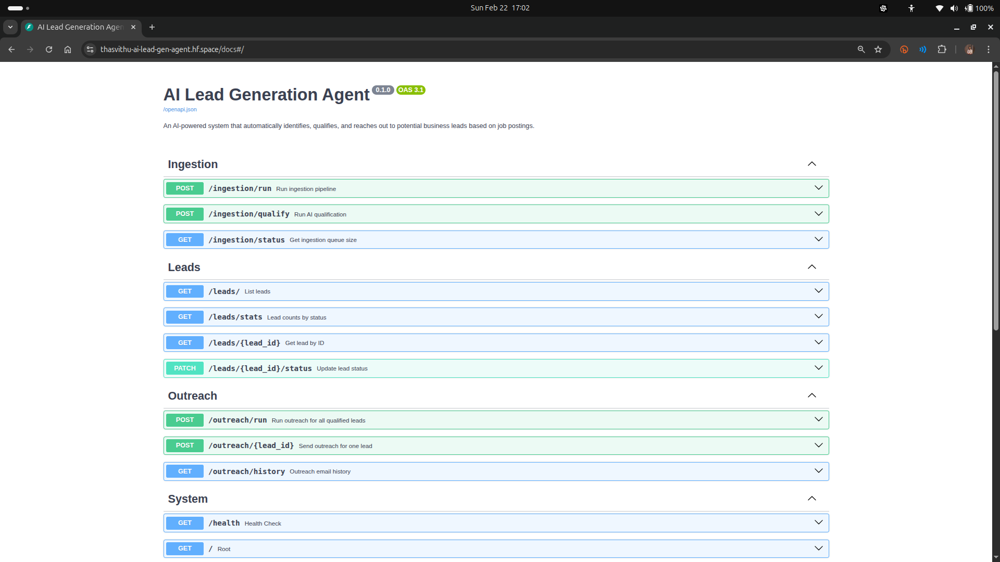

<div align="center">

# 🤖 AI Lead Generation Agent

**An autonomous AI agent that hunts, qualifies, and reaches out to your ideal customers — while you sleep.**

[](https://python.org)
[](https://fastapi.tiangolo.com)
[](https://langchain.com)
[](https://supabase.com)
[](https://huggingface.co/spaces/thasvithu/ai-lead-gen-agent)
[](#testing)
[](LICENSE)

<br/>

> You describe your product → the AI finds companies that need it → drafts personalized emails → sends them.

<br/>

## API Docs Preview



</div>

---

## 📖 Table of Contents

- [How It Works](#how-it-works)
- [Tech Stack](#tech-stack)
- [Project Structure](#project-structure)
- [Quick Start](#quick-start)
- [Configuration](#configuration)
- [API Reference](#api-reference)
- [CLI Scripts](#cli-scripts)
- [Testing](#testing)
- [Deployment](#deployment)

---

## ⚡ How It Works

The agent runs a fully automated 3-stage pipeline:

```
┌─────────────────────────────────────────────────────────────────────┐
│                                                                     │
│   📡 INGEST          🧠 QUALIFY            📧 OUTREACH              │
│                                                                     │
│  RemoteOK API   →   DeepSeek LLM    →   Gmail SMTP                 │
│  Fetch jobs         Score & filter      Draft & send                │
│  Normalize          Save leads          Log delivery                │
│  Dedup check        Update DB           Update status               │
│                                                                     │
└─────────────────────────────────────────────────────────────────────┘
```

### Stage 1 — Ingest
Fetches remote job postings from the [RemoteOK API](https://remoteok.com/api), normalizes them (strips HTML, extracts company domains), and applies a keyword pre-filter to find companies hiring engineering leaders (CTOs, VPs of Engineering, Engineering Managers — signals of a growing tech team).

### Stage 2 — AI Qualification
Sends each filtered posting through a LangChain chain powered by **DeepSeek V3 via OpenRouter**. The LLM outputs:
- `is_qualified` — boolean decision
- `relevance_score` — 0–100 score
- `reason` — why this company is a fit
- `target_contact_role` — who to email
- `company_pain_points` — what problems they likely have

Only leads scoring above the configurable threshold (default: 60) are saved.

### Stage 3 — Outreach
For each qualified lead, a second LLM chain drafts a personalized cold email referencing the company's specific pain points. The email is rendered into HTML, sent via Gmail SMTP, and the delivery status is logged to the database.

---

## 🛠 Tech Stack

| Layer | Technology | Purpose |
|---|---|---|
| **Language** | Python 3.11 | Core runtime |
| **LLM** | DeepSeek V3 via [OpenRouter](https://openrouter.ai) | Lead qualification + email drafting |
| **AI Framework** | LangChain | Prompt chains, output parsing |
| **API** | FastAPI + Uvicorn | REST API with auto-generated Swagger docs |
| **Database** | PostgreSQL via [Supabase](https://supabase.com) | Persistent lead & email storage |
| **ORM** | SQLAlchemy | Database models and queries |
| **Email** | Gmail SMTP (SSL) | Sending outreach emails |
| **Testing** | pytest | 69 unit tests, zero external deps |
| **Deployment** | Docker → HuggingFace Spaces | Cloud hosting |
| **CI/CD** | GitHub Actions | Auto-deploy + Supabase keep-alive |

---

## 📁 Project Structure

```
ai-lead-gen-agent/
│
├── 📂 api/                          # FastAPI REST layer
│   ├── main.py                      # App entry point, router wiring
│   ├── schemas.py                   # Pydantic request/response models
│   └── endpoints/
│       ├── ingestion_routes.py      # POST /ingestion/run, /qualify
│       ├── lead_routes.py           # GET/PATCH /leads
│       └── outreach_routes.py       # POST /outreach/run, GET /history
│
├── 📂 app/                          # Core business logic
│   ├── config.py                    # Centralized settings (pydantic-settings)
│   │
│   ├── 📂 ai_engine/                # LangChain AI layer
│   │   ├── processor.py             # qualify_lead(), draft_email() chains
│   │   ├── prompt_templates.py      # All prompt templates (centralized)
│   │   └── utils.py                 # LLM factory, JSON parser, text truncator
│   │
│   ├── 📂 db/                       # Database layer
│   │   ├── models.py                # SQLAlchemy ORM models
│   │   ├── repository.py            # All read/write operations (no raw SQL)
│   │   └── session.py               # Engine + session factory
│   │
│   ├── 📂 ingestion/                # Data ingestion layer
│   │   ├── fetcher.py               # RemoteOK API client (with retry)
│   │   ├── normalizer.py            # HTML stripping, field extraction
│   │   └── filters.py               # Keyword + AI-assisted filtering
│   │
│   ├── 📂 outreach/                 # Email outreach layer
│   │   ├── mailer.py                # Gmail SMTP sender (dry-run safe)
│   │   └── templates.py             # HTML email template renderer
│   │
│   └── 📂 services/                 # Orchestration layer
│       ├── lead_service.py          # AI qualification pipeline coordinator
│       └── scoring.py               # Lead qualification gate (score threshold)
│
├── 📂 scripts/                      # CLI tools
│   ├── run_ingestion.py             # Fetch and store job postings
│   ├── run_outreach.py              # Send emails to qualified leads
│   └── setup_db.py                  # Initialize database schema
│
├── 📂 tests/                        # Test suite (69 tests, 0 failures)
│   ├── conftest.py                  # Shared fixtures, env var injection
│   ├── test_ingestion.py            # 18 tests — fetcher, normalizer, filters
│   ├── test_ai_engine.py            # 19 tests — prompt rendering, JSON parsing
│   ├── test_db.py                   # 14 tests — repository CRUD (in-memory SQLite)
│   └── test_outreach.py             # 18 tests — template rendering, mailer dry-run
│
├── 📂 docs/                         # Documentation
│   ├── architecture.md              # System diagram + data flow
│   ├── api_docs.md                  # Full API reference
│   └── prompt_guidelines.md        # Prompt tuning guide
│
├── 📂 .github/workflows/            # GitHub Actions CI/CD
│   ├── deploy_hf.yml                # Auto-deploy to HuggingFace on push to main
│   └── keep_supabase_alive.yml      # Ping Supabase every 5 days (prevent pause)
│
├── Dockerfile                       # Multi-stage Docker build (port 7860 for HF)
├── docker-compose.yml               # Local development
├── requirements.txt                 # Python dependencies
└── .env.example                     # Environment variable template
```

---

## 🚀 Quick Start

### Prerequisites
- Python 3.11+
- A [Supabase](https://supabase.com) account (free tier)
- An [OpenRouter](https://openrouter.ai) API key (free DeepSeek model available)
- A Gmail account with [App Password enabled](https://support.google.com/accounts/answer/185833)

### 1. Clone & Install

```bash
git clone https://github.com/thasvithu/ai-lead-gen-agent.git
cd ai-lead-gen-agent
python -m venv .venv && source .venv/bin/activate
pip install -r requirements.txt
```

### 2. Configure Environment

```bash
cp .env.example .env
# Edit .env with your actual credentials
```

### 3. Initialize Database

```bash
python scripts/setup_db.py
```

### 4. Run the Pipeline

```bash
# Step 1 — Fetch & save job postings
python scripts/run_ingestion.py --limit 50

# Step 2 — Start the API (includes AI qualification endpoint)
uvicorn api.main:app --reload

# Step 3 — Qualify leads via API
curl -X POST http://localhost:8000/ingestion/qualify

# Step 4 — Preview outreach emails (dry-run, no emails sent)
python scripts/run_outreach.py --dry-run
```

### 5. Explore the API

Open **[http://localhost:8000/docs](http://localhost:8000/docs)** for the interactive Swagger UI.

---

## ⚙️ Configuration

All settings are loaded from `.env` via `app/config.py`:

| Variable | Required | Default | Description |
|---|:---:|---|---|
| `OPENROUTER_API_KEY` | ✅ | — | OpenRouter API key |
| `OPENROUTER_MODEL` | ✅ | — | e.g. `deepseek/deepseek-chat-v3-0324:free` |
| `DATABASE_URL` | ✅ | — | PostgreSQL URI (from Supabase) |
| `GMAIL_USER` | ✅ | — | Gmail sender address |
| `GMAIL_APP_PASSWORD` | ✅ | — | 16-character Gmail App Password |
| `PRODUCT_DESCRIPTION` | ✅ | — | What your product does (drives all AI prompts) |
| `MAILER_DRY_RUN` | ❌ | `true` | Print emails instead of sending |
| `MIN_RELEVANCE_SCORE` | ❌ | `60` | Minimum AI score to qualify a lead (0–100) |
| `MAX_JOBS_PER_RUN` | ❌ | `50` | Max jobs fetched per ingestion run |

> **💡 Tip:** Keep `MAILER_DRY_RUN=true` during testing — emails print to terminal instead of being sent.

---

## 🌐 API Reference

| Method | Endpoint | Description |
|---|---|---|
| `GET` | `/health` | Liveness check |
| `GET` | `/` | Service info |
| `POST` | `/ingestion/run` | Fetch + normalize + save job postings |
| `POST` | `/ingestion/qualify` | Run AI qualification on unprocessed postings |
| `GET` | `/ingestion/status` | Count of postings awaiting qualification |
| `GET` | `/leads` | List leads (filter by status, paginate) |
| `GET` | `/leads/stats` | Lead counts grouped by status |
| `GET` | `/leads/{id}` | Get a single lead with full detail |
| `PATCH` | `/leads/{id}/status` | Manually update lead status |
| `POST` | `/outreach/run` | Email all qualified leads |
| `POST` | `/outreach/{lead_id}` | Email a specific lead |
| `GET` | `/outreach/history` | Full email send history |

All endpoints have `dry_run=true` by default on send operations. Full interactive docs at `/docs`.

---

## 🖥 CLI Scripts

```bash
# Ingest job postings
python scripts/run_ingestion.py [--limit N] [--no-ai]

# Send outreach emails
python scripts/run_outreach.py [--limit N] [--dry-run] [--no-dry-run]

# Initialize database tables
python scripts/setup_db.py
```

---

## 🧪 Testing

```bash
# Run all 69 tests
python -m pytest tests/ -v

# Run by phase
python -m pytest tests/test_ingestion.py -v   # 18 tests
python -m pytest tests/test_ai_engine.py -v   # 19 tests
python -m pytest tests/test_db.py -v          # 14 tests (in-memory SQLite)
python -m pytest tests/test_outreach.py -v    # 18 tests (mocked SMTP)
```

All tests run **in isolation** — no real database, SMTP, or LLM calls required. A `conftest.py` injects dummy env variables so `pydantic-settings` doesn't block test collection.

---

## ☁️ Deployment

### HuggingFace Spaces (Recommended)

This project automatically deploys to HuggingFace Spaces via GitHub Actions on every push to `main`.

**One-time setup:**

1. Create a [HuggingFace Space](https://huggingface.co/new-space) → SDK: **Docker**
2. Add GitHub repository secrets:
   - `HF_TOKEN` → HuggingFace write token
   - `HF_USERNAME` → Your HF username
   - `HF_SPACE_NAME` → Your Space name
3. Add environment secrets in your HF Space → Settings → Variables & Secrets

**Live API:** `https://<username>-<space-name>.hf.space/docs`

### Docker (Local)

```bash
docker-compose up --build
# API available at http://localhost:8000/docs
```

---

## 🔄 GitHub Actions

| Workflow | Trigger | Description |
|---|---|---|
| `deploy_hf.yml` | Push to `main` | Auto-deploys to HuggingFace Spaces |
| `keep_supabase_alive.yml` | Every 5 days + manual | Pings Supabase REST API to prevent auto-pause |

---

## 📄 License

MIT © [Vithusan](https://github.com/thasvithu)
