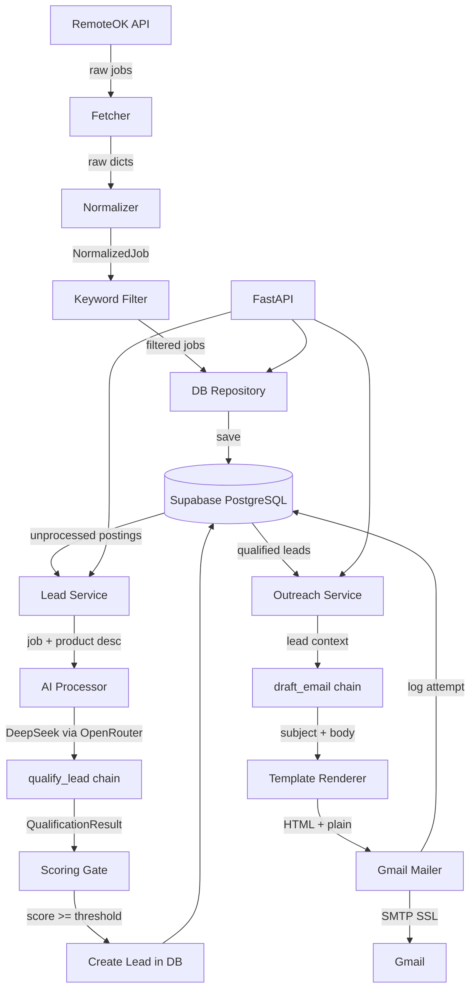

# Architecture

## System Overview

The AI Lead Generation Agent is a fully automated pipeline that:
1. **Ingests** remote job postings from RemoteOK
2. **Qualifies** companies using an LLM (DeepSeek via OpenRouter)
3. **Drafts** personalized cold outreach emails
4. **Sends** them via Gmail SMTP and tracks delivery

---

## Component Diagram



---

## Data Flow

### 1. Ingestion Pipeline
```
scripts/run_ingestion.py  OR  POST /ingestion/run
        │
        ▼
fetcher.py       → GET https://remoteok.com/api (with retry)
normalizer.py    → strip HTML, extract domain, parse date → NormalizedJob
filters.py       → keyword pre-filter (CTO, VP Eng, Head of Eng, ...)
repository.py    → dedup check → save to job_postings table
```

### 2. AI Qualification Pipeline
```
app/services/lead_service.py  OR  POST /ingestion/qualify
        │
        ▼
repository.get_unprocessed_postings()
        │
        ▼  (for each posting)
processor.qualify_lead()
    → LEAD_QUALIFICATION_PROMPT + DeepSeek LLM
    → QualificationResult(is_qualified, score, reason, contact_role, pain_points)
        │
        ▼
scoring.is_lead_qualified()    ← is_qualified=True AND score >= MIN_RELEVANCE_SCORE
        │
        ▼ (if qualified)
repository.create_lead()       → save to leads table
repository.mark_posting_processed()
```

### 3. Outreach Pipeline
```
scripts/run_outreach.py  OR  POST /outreach/run
        │
        ▼
repository.get_leads_for_outreach()   (status=QUALIFIED)
        │
        ▼  (for each lead)
processor.draft_email()
    → EMAIL_DRAFT_PROMPT + DeepSeek LLM
    → EmailDraft(subject, body)
        │
        ▼
templates.render_email()      → RenderedEmail(subject, html_body, plain_body)
        │
        ▼
GmailMailer.send()
    → log_outreach_email() with PENDING status
    → smtplib.SMTP_SSL (or dry-run print)
    → update_email_delivery_status() → SENT / FAILED
        │
        ▼
update_lead_status() → EMAILED
```

---

## Database Schema

```
companies
  id, name, domain, website, location, created_at

job_postings
  id, company_id (FK), title, description, url, source,
  posted_at, is_processed, created_at

leads
  id, company_id (FK), job_posting_id (FK),
  status (new|qualified|emailed|replied|rejected),
  relevance_score, ai_analysis, reason,
  contact_role, company_pain_points,
  created_at, updated_at

outreach_emails
  id, lead_id (FK), to_address, subject, body,
  delivery_status (pending|sent|failed),
  sent_at, error_message, created_at
```

---

## AI Prompts

Three LangChain `ChatPromptTemplate` objects in `app/ai_engine/prompt_templates.py`:

| Prompt | Input | Output |
|---|---|---|
| `KEYWORD_GENERATION_PROMPT` | `product_description` | JSON list of role keywords |
| `LEAD_QUALIFICATION_PROMPT` | `job_title`, `description`, `product_description` | JSON: score, reason, pain_points |
| `EMAIL_DRAFT_PROMPT` | `company_name`, `contact_role`, `pain_points`, `product_description` | JSON: subject, body |

All prompts instruct the LLM to respond with **pure JSON only** — no markdown fences.
The `parse_json_safely()` utility in `utils.py` handles malformed responses with regex fallback.

---

## Configuration

All settings loaded from `.env` via `app/config.py` (Pydantic BaseSettings):

| Setting | Default | Description |
|---|---|---|
| `OPENROUTER_API_KEY` | required | API key for OpenRouter |
| `OPENROUTER_MODEL` | `deepseek/deepseek-chat-v3-0324:free` | LLM model ID |
| `DATABASE_URL` | required | PostgreSQL connection URI |
| `GMAIL_USER` | required | Gmail sender address |
| `GMAIL_APP_PASSWORD` | required | 16-char Gmail App Password |
| `PRODUCT_DESCRIPTION` | required | Your product description (drives all AI prompts) |
| `MAILER_DRY_RUN` | `true` | Print emails instead of sending |
| `MIN_RELEVANCE_SCORE` | `60` | Minimum AI score to qualify a lead (0-100) |
| `MAX_JOBS_PER_RUN` | `50` | Max jobs fetched per ingestion run |
